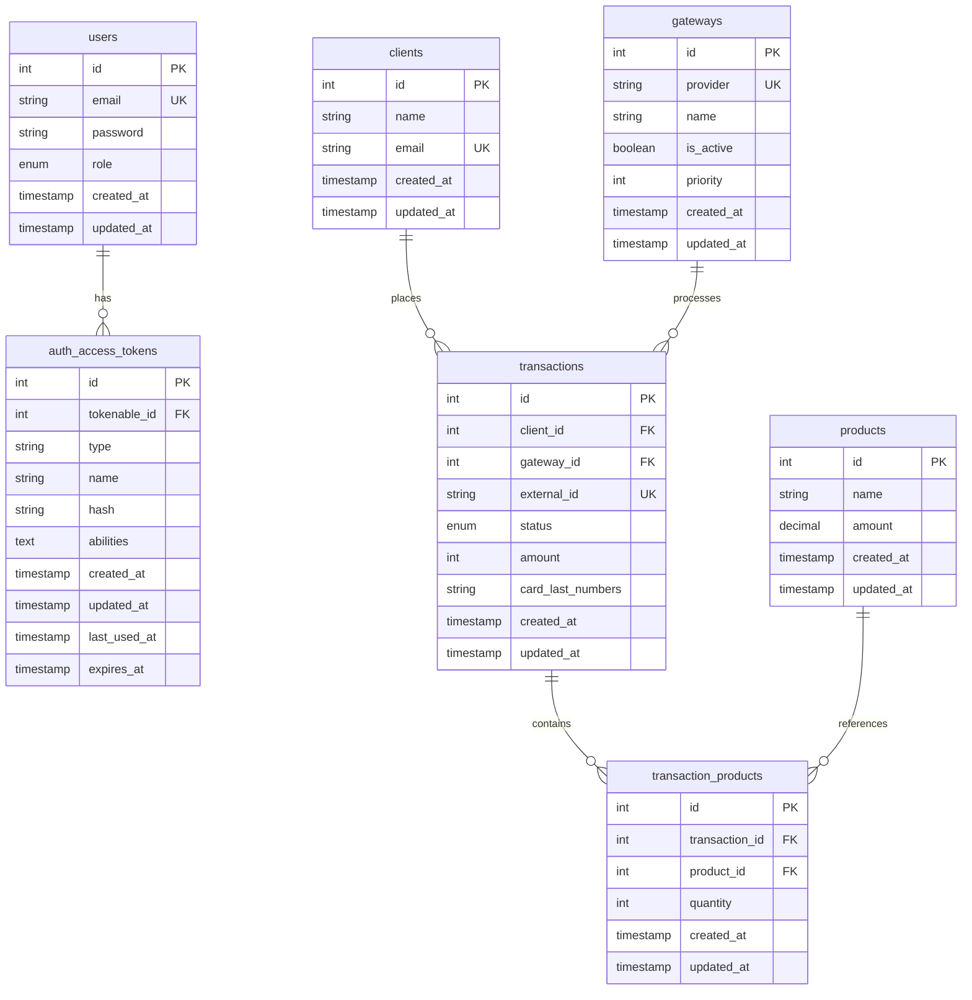

# Desafio Back-end BeTalent

API REST para processamento de pagamentos com multi-gateway, controle de acesso por perfil e persistência de transações usando AdonisJS, TypeScript e MySQL.

## Sumário

- [Visão geral](#visão-geral)
- [Stack utilizada](#stack-utilizada)
- [Sobre a escolha do AdonisJS](#sobre-a-escolha-do-adonisjs)
- [Requisitos](#requisitos)
- [Estrutura do projeto](#estrutura-do-projeto)
- [Diagrama do banco](#diagrama-do-banco)
- [Variáveis de ambiente](#variáveis-de-ambiente)
- [Como instalar e rodar o projeto](#como-instalar-e-rodar-o-projeto)
  - [Opção 1: stack completa com Docker](#opção-1-stack-completa-com-docker)
  - [Opção 2: API local e dependências auxiliares via Docker](#opção-2-api-local-e-dependências-auxiliares-via-docker)
- [Scripts úteis](#scripts-úteis)
- [Comportamento da stack](#comportamento-da-stack)
- [Autenticação](#autenticação)
- [Formato de resposta](#formato-de-resposta)
- [Formato de erro](#formato-de-erro)
- [Regras de acesso por perfil](#regras-de-acesso-por-perfil)
- [Detalhamento de rotas](#detalhamento-de-rotas)
- [Coleção Postman](#coleção-postman)
- [Dificuldades encontradas](#dificuldades-encontradas)
- [Pendências](#pendências)
- [Testes](#testes)

## Visão geral

O projeto implementa um fluxo de compra público. Ao receber uma compra, a API:

1. valida comprador, cartão e itens
2. busca os gateways ativos ordenados por prioridade
3. tenta autorizar o pagamento no primeiro gateway disponível
4. faz fallback para o próximo gateway em caso de falha
5. persiste a transação autorizada
6. permite consultar e, quando aplicável, reembolsar a transação

## Stack utilizada

| Tecnologia     | Para que é usada no projeto                                                                     |
| -------------- | ----------------------------------------------------------------------------------------------- |
| AdonisJS 7     | Framework principal da API REST, organização da aplicação, rotas, providers e ciclo de execução |
| TypeScript     | Tipagem estática, contratos mais seguros e melhor manutenção do código                          |
| MySQL          | Persistência de usuários, gateways, compras e transações                                        |
| Lucid ORM      | Mapeamento entre models e banco de dados, além de consultas, migrations e seeders               |
| VineJS         | Validação de payloads recebidos pela API                                                        |
| Japa           | Execução dos testes automatizados                                                               |
| Swagger/OpenAPI | Documentação interativa da API em `/docs` e especificação OpenAPI em `/swagger`                |
| Docker Compose | Orquestração da stack local com API, bancos MySQL e mocks de gateway                            |

## Sobre a escolha do AdonisJS

A maior parte da minha experiência prática está em Laravel e no ecossistema PHP. Escolhi AdonisJS para demonstrar domínio de princípios de arquitetura, modelagem e organização de código fora da stack em que atuei por mais tempo.

## Requisitos

### Para rodar com Docker

- Docker
- Docker Compose

### Para rodar localmente sem container para a API

- Node.js 25
- npm
- MySQL disponível para ambiente principal
- MySQL disponível para testes de integração
- gateway mocks acessíveis nas portas configuradas

## Estrutura do projeto

- `compose.yml`: stack principal com API, MySQL principal, MySQL de teste e gateway mocks
- `scripts/init-env.sh`: gera os arquivos de ambiente a partir dos exemplos
- `scripts/start-stack.sh`: inicializa a stack completa
- `adonis/`: aplicação AdonisJS
- `adonis/app/domain`: entidades, enums, exceptions e primitives
- `adonis/app/application`: serviços, contratos e regra de negócio
- `adonis/app/adapters`: controllers, validators, middleware, policies e transformers
- `adonis/app/infrastructure`: models, repositórios e clientes HTTP dos gateways
- `adonis/database`: migrations, factories e seeders
- `adonis/tests`: testes unitários e funcionais

## Diagrama do banco

O diagrama abaixo foi montado a partir das migrations em `adonis/database/migrations` e representa todas as tabelas persistidas pela aplicação.



Leitura rápida das relações:

- `users` possui vários `auth_access_tokens`
- `clients` possui várias `transactions`
- `gateways` processa várias `transactions`
- `transaction_products` faz a ligação N:N entre `transactions` e `products`, armazenando também a `quantity`

## Variáveis de ambiente

Os arquivos de exemplo versionados no repositório são:

- `.env.example`: variáveis da stack na raiz
- `adonis/.env.local.example`: variáveis para rodar a API localmente
- `adonis/.env.docker.example`: variáveis para rodar a API dentro do container

Para gerar os arquivos reais:

```bash
./scripts/init-env.sh
```

Esse script cria, sem sobrescrever por padrão:

- `.env`
- `adonis/.env`
- `adonis/.env.docker`

Para recriar os arquivos a partir dos exemplos:

```bash
./scripts/init-env.sh --force
```

Variáveis mais importantes:

- `API_PORT`: porta exposta pela API na stack Docker
- `INITIAL_USER_EMAIL`: e-mail do usuário inicial criado no seeder
- `INITIAL_USER_PASSWORD`: senha do usuário inicial criado no seeder
- `INITIAL_USER_ROLE`: role do usuário inicial criado no seeder
- `MYSQL_DATABASE`, `MYSQL_HOST`, `MYSQL_PORT`, `MYSQL_USER`, `MYSQL_PASSWORD`: conexão principal com MySQL
- `MYSQL_TEST_DATABASE`, `MYSQL_TEST_HOST`, `MYSQL_TEST_PORT`, `MYSQL_TEST_USER`, `MYSQL_TEST_PASSWORD`: conexão usada nos testes de integração
- `GATEWAY_ONE_BASE_URL` e `GATEWAY_TWO_BASE_URL`: endereços dos mocks de gateway consumidos pela API
- `GATEWAY_AUTH_TOKEN`, `GATEWAY_AUTH_SECRET`, `GATEWAY_ONE_LOGIN_EMAIL` e `GATEWAY_ONE_LOGIN_TOKEN`: credenciais usadas para autenticar nas integrações externas simuladas

Se alguma porta for alterada, mantenha `.env` e `adonis/.env` sincronizados para que a aplicação consiga se conectar corretamente aos serviços da stack.

## Como instalar e rodar o projeto

### Opção 1: stack completa com Docker

1. Gere os arquivos de ambiente:

```bash
./scripts/init-env.sh
```

2. Suba a stack:

```bash
./scripts/start-stack.sh
```

Ou manualmente:

```bash
docker compose up -d --build
```

3. Acesse os serviços:

- API: `http://localhost:${API_PORT}` (`3333` por padrão no `.env.example`)
- Swagger UI: `http://localhost:${API_PORT}/docs`
- OpenAPI YAML: `http://localhost:${API_PORT}/swagger`
- Gateway mock 1: `http://localhost:3001`
- Gateway mock 2: `http://localhost:3002`
- MySQL principal: `localhost:3306`
- MySQL de teste: `localhost:13307`

4. Credenciais iniciais criadas pelo seeder:

```text
email: admin@example.com
password: password123
role: ADMIN
```

### Opção 2: API local e dependências auxiliares via Docker

1. Gere os arquivos de ambiente:

```bash
./scripts/init-env.sh
```

2. Suba apenas as dependências:

```bash
docker compose up -d mysql mysql_test gateway-mocks
```

3. Instale as dependências da API:

```bash
cd adonis
npm install
```

4. Rode migrações e seeders:

```bash
node ace migration:run
node ace db:seed
```

5. Inicie a API em desenvolvimento:

```bash
npm run dev
```

6. Acesse a aplicação e a documentação:

- API local: `http://localhost:${PORT}` (`3333` por padrão no `adonis/.env.local.example`)
- Swagger UI local: `http://localhost:${PORT}/docs`
- OpenAPI YAML local: `http://localhost:${PORT}/swagger`

Se alguma dessas portas for alterada na stack, ajuste também o `adonis/.env`.

## Scripts úteis

### Na raiz do repositório

- `./scripts/init-env.sh`: cria os arquivos `.env` necessários
- `./scripts/init-env.sh --force`: recria os arquivos `.env`
- `./scripts/start-stack.sh`: sobe a stack
- `./scripts/start-stack.sh --force`: recria os arquivos de ambiente antes de subir
- `./scripts/start-stack.sh --detach`: sobe em background
- `./scripts/start-stack.sh --no-build`: sobe sem rebuild da imagem

### Dentro de `adonis/`

- `npm run dev`: sobe a API em modo desenvolvimento
- `npm run dev:doc`: sobe a API em modo desenvolvimento usando `serve --watch`, útil ao validar a documentação Swagger durante o desenvolvimento
- `npm run docs:generate`: gera os arquivos `swagger.yml` e `swagger.json`
- `npm run build`: gera o build da aplicação
- `npm run start`: sobe a aplicação compilada
- `npm test`: executa os testes
- `npm run lint`: executa o lint
- `npm run format`: formata o código
- `npm run typecheck`: executa a checagem de tipos

## Comportamento da stack

No startup do serviço `adonis` via Docker, a aplicação executa automaticamente:

- `migration:run`
- `db:seed`
- `server`

O seeder inicial cria:

- um usuário inicial com base em `INITIAL_USER_EMAIL`, `INITIAL_USER_PASSWORD` e `INITIAL_USER_ROLE`
- dois gateways:
  - `Gateway 1` com prioridade `1`
  - `Gateway 2` com prioridade `2`

## Autenticação

Todas as rotas usam o prefixo `/api/v1`.

- Rotas públicas:
  - `POST /api/v1/auth/login`
  - `POST /api/v1/purchases`
- Demais rotas exigem `Authorization: Bearer <token>`

## Documentação Swagger

A aplicação expõe a documentação interativa e o arquivo OpenAPI nos seguintes endpoints:

- `GET /docs`: interface Swagger UI
- `GET /swagger`: especificação OpenAPI em YAML

Formas de acesso mais comuns:

- Rodando a API localmente: `http://localhost:3333/docs` e `http://localhost:3333/swagger`
- Rodando a stack Docker: `http://localhost:3333/docs` e `http://localhost:3333/swagger` com a configuração padrão do `.env.example`

Se você alterar as portas:

- Ambiente local: use a porta definida em `PORT` no arquivo `adonis/.env`
- Docker: use a porta definida em `API_PORT` no arquivo `.env`

Para gerar os artefatos de documentação usados no build de produção:

```bash
cd adonis
npm run docs:generate
```

## Formato de resposta

A maior parte das respostas de sucesso da API segue o padrão:

```json
{
  "data": {}
}
```

Ou, para coleções:

```json
{
  "data": []
}
```

Exemplos nesse formato:

- `POST /api/v1/auth/login`
- `GET /api/v1/users`
- `POST /api/v1/users`
- `GET /api/v1/gateways`
- `GET /api/v1/products`
- `POST /api/v1/purchases`

Exceções atuais:

- endpoints de remoção retornam `{ "message": "..." }`
- `GET /api/v1/clients/:id` retorna o cliente e o histórico diretamente no objeto raiz

## Formato de erro

As respostas de erro também são retornadas em JSON.

Status mais comuns:

- `401`: requisição sem autenticação quando a rota exige token
- `403`: usuário autenticado sem permissão para a ação
- `404`: recurso não encontrado
- `422`: erro de validação ou regra de negócio

Formato de erro:

```json
{
  "errors": [
    {
      "message": "..."
    }
  ]
}
```

Para erros de validação, os itens também podem incluir metadados adicionais, como:

```json
{
  "errors": [
    {
      "message": "...",
      "field": "priority",
      "rule": "min"
    }
  ]
}
```

## Regras de acesso por perfil

Como não foi informada uma relação de hierarquia entre as roles, as permissões foram consideradas de forma literal.

- `ADMIN`: pode executar todas as ações da aplicação
- `MANAGER`: pode gerenciar usuários e produtos
- `FINANCE`: pode gerenciar produtos e realizar reembolso
- `USER`: pode consultar produtos e operar rotas autenticadas de gateways

## Detalhamento de rotas

### Autenticação

| Método | Rota                 | Acesso  | Payload / observações     |
| ------ | -------------------- | ------- | ------------------------- |
| POST   | `/api/v1/auth/login` | Pública | Body: `email`, `password` |

Observação:

- a action de logout existe no controller, mas não há rota exposta para ela no estado atual da aplicação

### Usuários

| Método | Rota                | Acesso             | Payload / observações                                     |
| ------ | ------------------- | ------------------ | --------------------------------------------------------- |
| GET    | `/api/v1/users`     | `ADMIN`, `MANAGER` | Lista usuários                                            |
| POST   | `/api/v1/users`     | `ADMIN`, `MANAGER` | Body: `email`, `password`, `passwordConfirmation`, `role` |
| GET    | `/api/v1/users/:id` | `ADMIN`, `MANAGER` | Busca usuário por id                                      |
| PATCH  | `/api/v1/users/:id` | `ADMIN`, `MANAGER` | Body opcional: `email`, `password`, `role`                |
| DELETE | `/api/v1/users/:id` | `ADMIN`, `MANAGER` | Remove usuário                                            |

Restrições adicionais para `MANAGER`:

- não pode alterar ou remover usuários `ADMIN`
- não pode alterar ou remover outro `MANAGER`
- pode alterar ou remover apenas o próprio usuário quando o alvo também for `MANAGER`

Observação:

- ao criar um usuário, a API também retorna um token de acesso para esse novo usuário
- fique atento para não dar downgrade no usuário `ADMIN`

### Gateways

| Método | Rota                            | Acesso               | Payload / observações                                   |
| ------ | ------------------------------- | -------------------- | ------------------------------------------------------- |
| GET    | `/api/v1/gateways`              | Qualquer autenticado | Lista gateways com `id`, `name`, `isActive`, `priority` |
| PATCH  | `/api/v1/gateways/:id/status`   | Qualquer autenticado | Body: `isActive`                                        |
| PATCH  | `/api/v1/gateways/:id/priority` | Qualquer autenticado | Body: `priority` inteiro maior ou igual a `1`           |

### Produtos

| Método | Rota                   | Acesso                                | Payload / observações           |
| ------ | ---------------------- | ------------------------------------- | ------------------------------- |
| GET    | `/api/v1/products`     | `ADMIN`, `MANAGER`, `FINANCE`, `USER` | Lista produtos                  |
| POST   | `/api/v1/products`     | `ADMIN`, `MANAGER`, `FINANCE`         | Body: `name`, `amount`          |
| GET    | `/api/v1/products/:id` | `ADMIN`, `MANAGER`, `FINANCE`, `USER` | Busca produto por id            |
| PATCH  | `/api/v1/products/:id` | `ADMIN`, `MANAGER`, `FINANCE`         | Body opcional: `name`, `amount` |
| DELETE | `/api/v1/products/:id` | `ADMIN`, `MANAGER`, `FINANCE`         | Remove produto                  |

Observação:

- `amount` deve ser enviado e retornado como string decimal no formato `0.00`

### Compras

| Método | Rota                | Acesso  | Payload / observações                                 |
| ------ | ------------------- | ------- | ----------------------------------------------------- |
| POST   | `/api/v1/purchases` | Pública | Body: `name`, `email`, `cardNumber`, `cvv`, `items[]` |

Formato esperado de `items[]`:

```json
[
  {
    "productId": 1,
    "quantity": 2
  }
]
```

Validações relevantes:

- `cardNumber`: exatamente 16 dígitos
- `cvv`: exatamente 3 dígitos
- `items`: precisa ter ao menos um item
- `items[].quantity`: inteiro maior que `0`

Comportamento da rota:

- os gateways ativos são tentados por ordem de prioridade
- se dois gateways tiverem a mesma prioridade, o desempate é feito por `id`
- se um gateway falhar, a API tenta o próximo
- o valor total é calculado internamente com base no valor cadastrado de cada produto
- a resposta inclui `amount` e os itens com produto e quantidade

### Clientes

| Método | Rota                  | Acesso          | Payload / observações                               |
| ------ | --------------------- | --------------- | --------------------------------------------------- |
| GET    | `/api/v1/clients`     | `ADMIN`, `USER` | Lista clientes                                      |
| GET    | `/api/v1/clients/:id` | `ADMIN`, `USER` | Retorna cliente e histórico detalhado de transações |

### Transações

| Método | Rota                              | Acesso             | Payload / observações                                                 |
| ------ | --------------------------------- | ------------------ | --------------------------------------------------------------------- |
| GET    | `/api/v1/transactions`            | `ADMIN`, `FINANCE` | Filtros opcionais via query string: `status`, `clientId`, `gatewayId` |
| GET    | `/api/v1/transactions/:id`        | `ADMIN`, `FINANCE` | Retorna detalhes da transação, cliente, gateway e itens               |
| POST   | `/api/v1/transactions/:id/refund` | `ADMIN`, `FINANCE` | Reembolsa apenas transações em status `authorized`                    |

Valores aceitos para `status` no filtro:

- `pending`
- `authorized`
- `failed`
- `refunded`

## Coleção Postman

Para facilitar a execução manual da API, o repositório inclui a coleção:

- `postman/betalent.postman_collection.json`

Como usar:

1. Importe o arquivo no Postman.
2. Ajuste `baseUrl` se necessário.
3. Execute as pastas na ordem em que aparecem.
4. A coleção gera variáveis dinâmicas por execução usando `runId`.
5. A pasta `Setup` cria usuários, faz login por perfil e cria os produtos necessários para o restante do fluxo.

A coleção cobre:

- autenticação
- usuários
- gateways
- produtos
- compras
- clientes
- transações

## Dificuldades encontradas

Pela similaridade da estrutura com Laravel, framework com o qual já tenho bastante experiência, grande parte do desenvolvimento ocorreu de forma natural e sem bloqueios relevantes.

A principal dificuldade apareceu no runtime do AdonisJS, especialmente na configuração do container de dependências e no ajuste do ambiente para execução da aplicação. Ainda assim, esse ponto foi resolvido rapidamente após alinhar a configuração do projeto e dos serviços de apoio.

Também senti falta de uma ferramenta que garantisse a entrada no controller já com os dados validados. Embora o fluxo atual funcione, a necessidade de acionar essa validação explicitamente em cada endpoint pode abrir espaço para problemas caso esse passo seja esquecido em algum momento, além de repetir um cuidado importante em todos os controllers.

Outra dificuldade foi a interpretação correta da aplicação e do que de fato era esperado pelo desafio. Como não havia conversa direta com stakeholder para validar entendimento, foi necessário reinterpretar alguns pontos ao longo do desenvolvimento para ajustar a solução à proposta esperada.

## Pendências

Todos os requisitos do desafio foram implementados e estão em funcionamento.

A única decisão que exigiu interpretação foi a matriz de permissões para rotas além de usuários, produtos e reembolso, já que o enunciado não especificava acesso explícito para todos os perfis nesses casos. A decisão tomada está documentada na seção de regras de acesso por perfil.

## Testes

A construção dos testes seguiu TDD como abordagem de desenvolvimento, usando os cenários como apoio para modelar as regras de negócio e validar o comportamento esperado a cada etapa.

A estratégia foi inspirada no livro `Unit Testing Principles, Practices, and Patterns`, de Vladimir Khorikov. Como a abordagem escolhida foi a Clássica/Detroit, a construção da suíte partiu dos testes de domínio e avançou até os testes funcionais com a orquestração completa da aplicação.

Na prática, isso significa que os testes buscaram exercitar middlewares, classes reais e banco de dados de forma integrada, preservando o máximo possível do comportamento real do sistema. O mock foi mantido apenas nos gateways externos, por serem dependências fora do meu controle e com respostas não determinísticas.

No estado atual do projeto, a suíte possui 229 testes automatizados cobrindo principalmente:

- primitives, entidades e regras centrais de domínio
- autenticação e controle de acesso por perfil
- CRUD de usuários, produtos e gateways
- fluxo de compra com cálculo interno, fallback entre gateways e persistência
- listagem e detalhamento de clientes e transações
- reembolso e cenários de falha

Para executar os testes:

```bash
cd adonis
npm install
npm test
```

### Workflow no GitHub

O repositório inclui o workflow `CI`, definido em `.github/workflows/ci.yml`, com lint, execução da suíte e coverage.

Por ele, é possível visualizar no próprio GitHub:

- o resultado dos testes
- o log completo da suíte
- a saída de coverage

Para visualizar essas informações:

1. Acesse a aba `Actions` do repositório.
2. Abra uma execução do workflow `CI`.
3. Entre no job `ci`.
4. Veja os steps de validação, em especial `Run tests with coverage`.
